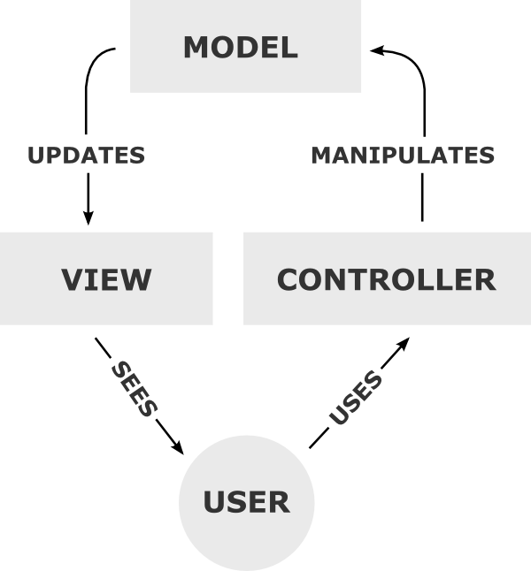

# Overview of web software development

## Web applications and HTTP

Web applications are a kind of distributed applications that run on top of an HTTP channel.
The foundation of the World Wide Web is the HTTP protocol, an application level TCP/IP protocol that uses the client-server paradigm in which multiple clients and one server exchange request and response messages.

HTTP messages contain a body and a [header](http://en.wikipedia.org/wiki/List_of_HTTP_header_fields), which specifies, among other things, the type of content that the client accepts as a response (i.e. the _accept_ header) and the MIME type of the body of the request (i.e. the _content-type_ header).

The HTTP protocol imposes a significant limitation to build distributed applications: it is a [stateless](http://en.wikipedia.org/wiki/Stateless_protocol) protocol. When a protocol supports [state](http://en.wikipedia.org/wiki/State_(computer_science)), that means that it provides for the interaction between client and server to contain a sequence of commands (often called a _session_). Many TCP/IP protocols are stateful (e-g- FTP, STMTP, etc.) but HTTP is not. An HTTP transaction consists of a single request from a client to a server, followed by a single response from the server back to the client. There is no way to maintain persistent information about a session as part of the HTTP definition. Therefore, sessions have to be provided by the external applications. A mechanism of the HTTP protocol used to define something that resembles the session concept is the use of [cookies](http://en.wikipedia.org/wiki/HTTP_cookie) to maintain state in web applications.

### Web servers and CGI

Web servers enable HTTP access to _web sites_, which are simple collections of _static_ documents and other resources organized as a hierarchical file system. Web servers also enable passing requests to custom software applications or scripts that provide access to _dynamic_ content. 

The web server does not often build the dynamic content by itself. Instead, it delegates building the final HTML page to a separate software component that is constructed using a programming language (such as PHP, Java, Python, Ruby, etc.). That component is programmed to retrieved the dynamic content from a database, a search engine or any other information system, which can be queried according to a set of selection criteria.

The primary approach for accessing dynamic data from a web server is the [Common Gateway Interface](http://en.wikipedia.org/wiki/Common_Gateway_Interface) (CGI), which provides an interface between the web server and the programs or scripts that generate the dynamic content. The CGI has limitations concerning performance and security. Due to CGI limitations, many alternatives are used instead, including template languages (e.g. PHP, ASP, JSP, etc.) and [application servers](http://en.wikipedia.org/wiki/Application_server), which are language-specific frameworks that can render HTML content by using an API ([Application Programming Interface](http://en.wikipedia.org/wiki/Application_programming_interface)), such as the [Java Servlets](http://en.wikipedia.org/wiki/Java_servlet) API or the [.NET framework](http://en.wikipedia.org/wiki/Application_server#.NET_Framework), or by means of a template engine (e.g. [JavaServer Pages](http://en.wikipedia.org/wiki/JavaServer_Pages)).

### Web Application Architecture

Web applications are a kind of distributed applications that run on top of an HTTP channel. Some of the limitations of the HTTP protocol have to be overcome by designing an appropriate  architecture and using a web framework that supports building web applications.

Web applications are usually designed with a  [multi-layered](http://en.wikipedia.org/wiki/Multilayered_architecture) or [multi-tier](http://en.wikipedia.org/wiki/Multitier_architecture) architecture, according to one of [Buschmann](http://eu.wiley.com/WileyCDA/WileyTitle/productCd-0471958697.html)'s architectural patterns. The three-tier architecture defines the logic of a web app being part of either the presentation tier, the application (or business logic) tier, or the data tier. Each application component has to be deployed in a logical node that runs its software. Thus, we can differentiate between (1) the data tier and the data access tier, and (2) the client tier, the web tier and the presentation logic tier. The following picture describes the primary architectural components of a typical web application and maps each component to the main tiers.

The client tier runs in the client browser that renders the (generally) HTML content that is delivered by the application. The web tier is the (generally) HTTP channel that transports HTTP messages between the client browser and the web server. The web layer is almost invisible to the web architect, since it is part of the World Wide Web foundations. The web server retrieves or constructs the HTML pages as part of the presentation logic tier. It may retrieve the HTML (static) resource directly from the server storage, or may build the HTML (dynamic) resource on-the-fly as HTTP requests arrive. Finally, a lot of dynamic HTML page content is retrieved from external information systems or databases. The data access tier provides access to such information systems (generally databases) that are part of the data tier.

In a web application, all its components have to collaborate to serve the client's requests. The client is normally a user browsing in the Web with an HTTP-enabled browser. But it might be also an automated agent (i.e. a computer program) that is specifically programmed to perform a task by interacting with the web server using HTTP. Thus, the client might be replaced, and this should not affect the web application architecture. If the relevant data to build the web application does not come from a classical database but from a different source (for instance, from an old and robust legacy application that was programmed years ago, and the system owner does not want to dispose of it), we have to ensure that the data source might be also replaced without affecting the rest of architectural components of the web app. Even if the HTTP protocol was eventually replaced by another protocol in the World Wide Web, we would not want to dispose all of the application business logic due to this change. All potential changes motivate the use of a well-known application architecture that facilitates replacing one kind of component by another without disturbing too much. The architectural pattern that enables such changes, that is followed by most web application designers, is the [Model-View-Controller](http://en.wikipedia.org/wiki/Model%E2%80%93view%E2%80%93controller) (MVC) pattern. 

## The MVC pattern and the Web

The Model-View-Controlled is defined by [Buschmann](http://eu.wiley.com/WileyCDA/WileyTitle/productCd-0471958697.html) as an architectural pattern useful for interactive systems, and defined by [Fowler](http://martinfowler.com/) as a Web Presentation pattern in its [Catalog of Patterns of Enterprise Application Architecture](http://martinfowler.com/eaaCatalog/). The MVC pattern is the most quoted (and most  misquoted) in the development of web applications.

The purpose of the MVC pattern is to decouple the different logics in a multi-tiered application architecture. Typically, it is used to decouple the business components from the data access logic (that provides access to the __model__), and to decouple the presentation components (that implements the __view__)  from the business logic (i.e. the __controller__ components), as depicted in the following figure.

There are many alternatives to the basic MVC architecture (e.g. [Hierarchical MVC](http://en.wikipedia.org/wiki/Hierarchical_model%E2%80%93view%E2%80%93controller), [Model–View–Adapter](http://en.wikipedia.org/wiki/Model%E2%80%93view%E2%80%93adapter), [Model–View–Presenter](http://en.wikipedia.org/wiki/Model%E2%80%93view%E2%80%93presenter), [Model- View-ViewModel](http://en.wikipedia.org/wiki/Model_View_ViewModel), and [Presentation–Abstraction–Control](http://en.wikipedia.org/wiki/Presentation%E2%80%93abstraction%E2%80%93control)). There is an fundamental difference underlying to all of them: they can be either _active_ of _passive_ versions of the MVC model. The model notifies its associated views and controllers when there has been a change in its state. This notification allows the views to produce updated output, and the controllers to change the available set of commands. In some cases an MVC implementation might be passive so that other components must poll the model for updates rather than being notified.

