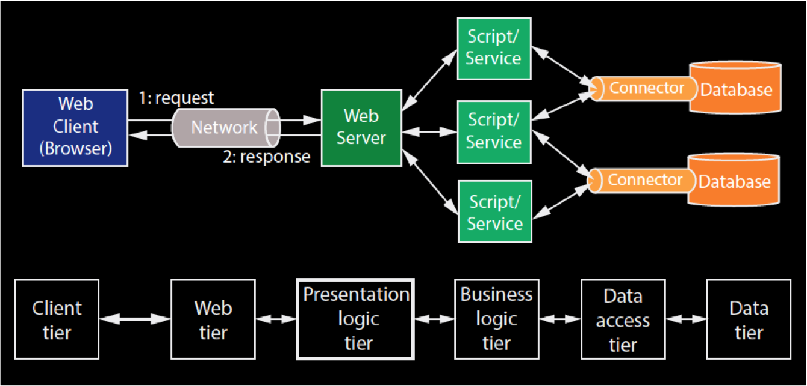
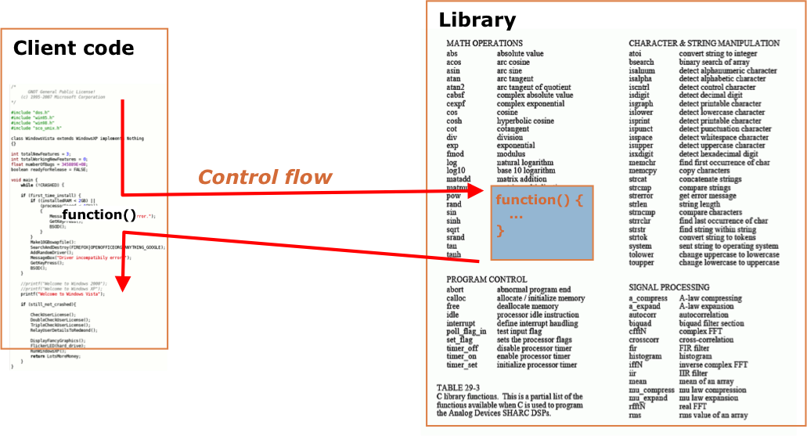
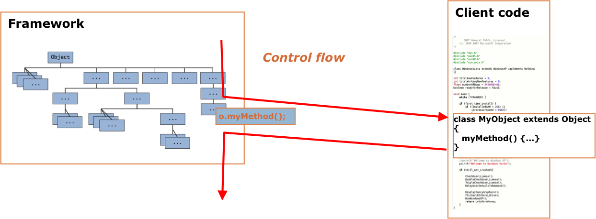
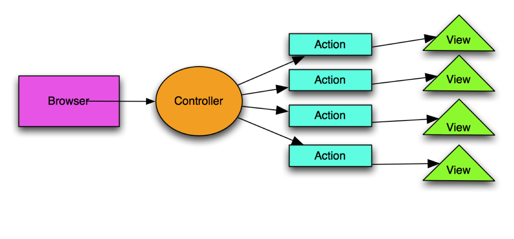
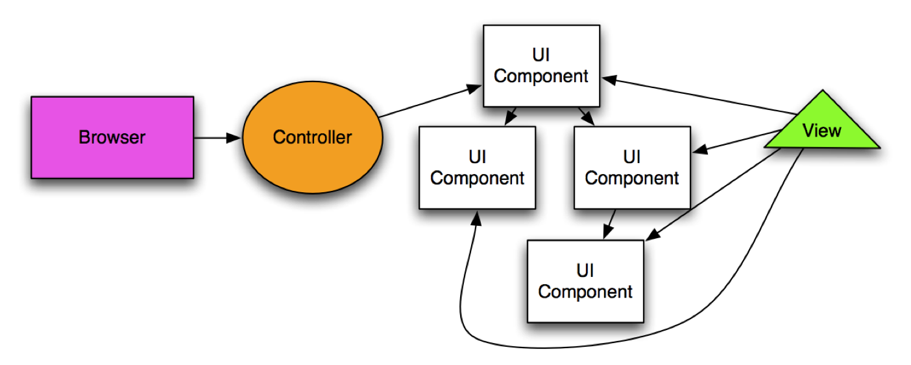
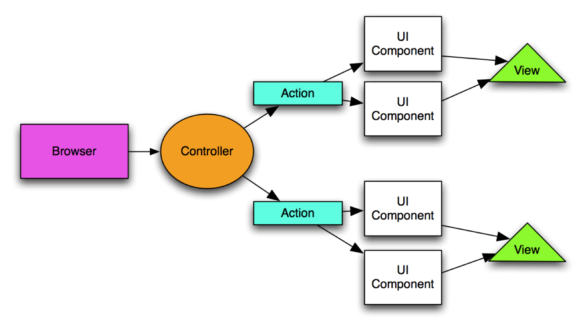
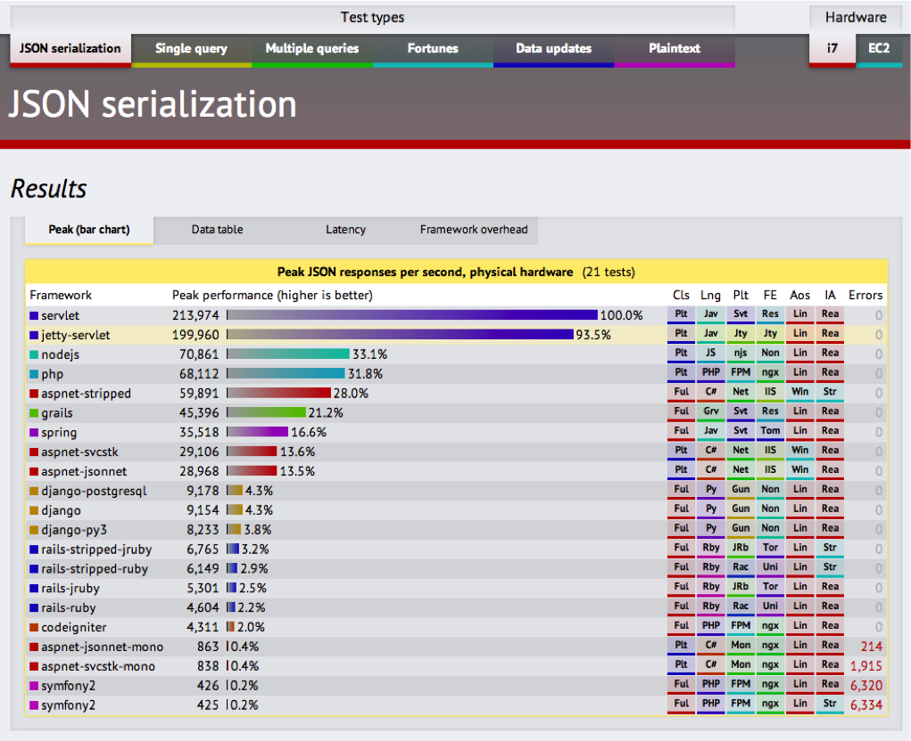

# Web construction frameworks

## Web applicationa and HTTP

Web applications are a kind of distributed applications that run on top of an HTTP channel.
The foundation of the World Wide Web is the HTTP protocol, an application level TCP/IP protocol that uses the client-server paradigm in which multiple clients and one server exchange request and response messages.

HTTP messages contain a body and a [header](http://en.wikipedia.org/wiki/List_of_HTTP_header_fields), which specifies, among other things, the type of content that the client accepts as a response (i.e. the _accept_ header) and the MIME type of the body of the request (i.e. the _content-type_ header).

The HTTP protocol imposes a significant limitation to build distributed applications: it is a _stateless_ protocol. When a protocol supports _state_, that means that it provides for the interaction between client and server to contain a sequence of commands (often called a _session_). Many TCP/IP protocols are stateful (e-g- FTP, STMTP, etc.) but HTTP is not. An HTTP transaction consists of a single request from a client to a server, followed by a single response from the server back to the client. There is no way to maintain persistent information about a session as part of the HTTP definition. Therefore, sessions have to be provided by the external applications. A mechanism of the HTTP protocol used to define something that resembles the session concept is the use of [cookies](http://en.wikipedia.org/wiki/HTTP_cookie) to maintain state in web applications.

### CGI

### Web Applications Architecture

Web applications are a kind of distributed applications that run on top of an HTTP channel. Some of the limitations of the HTTP protocol have to be overcome by designing an appropriate  architecture and using a web framework that supports building web applications.

Web applications are usually designed with a  [multi-layered](http://en.wikipedia.org/wiki/Multilayered_architecture) or [multi-tier](http://en.wikipedia.org/wiki/Multitier_architecture) architecture, according to one of [Buschmann](http://eu.wiley.com/WileyCDA/WileyTitle/productCd-0471958697.html)'s architectural patterns. The three-tier architecture defines the logic of a web app being part of either the presentation tier, the application (or business logic) tier, or the data tier. Each application component has to be deployed in a logical node that runs its software. Thus, we can differentiate between (1) the data tier and the data access tier, and (2) the client tier, the web tier and the presentation logic tier. The following picture describes the primary architectural components of a typical web application and maps each component to the main tiers.



The client tier runs in the client browser that renders the (generally) HTML content that is delivered by the application. The web tier is the (generally) HTTP channel that trasports HTTP messages between the client browser and the web server. The web layer is almost invisible to the web architect, since it is part of the World Wide Web foundations. The web server retrieves or constructs the HTML pages as part of the presentation logic tier. It may retrieve the HTML (static) resource directly from the server storage, or may build the HTML (dynamic) resource on-the-fly as HTTP requests arrive. The web server does not often build the dynamic resources by itself, instead it delegates building the page to a different scripting component  (e.g. a PHP module, a Java server engine, etc.) that can be programmed using any language like PHP, Java, Python, Ruby, etc. Finally, a lot of dynamic HTML page content is retrieved from external information systems or databases. The data access tier provides access to such information systems (generally databases) that are part of the data tier.

In a web application, all its components have to collaborate to serve the client's requests. The client is normally a user browsing in the Web with an HTTP-enabled browser. But it might be also an automated agent (i.e. a computer program) that is specifically programmed to perform a task by interacting with the web server using HTTP. Thus, the client might be replaced, and this should not affect the web application architecture. If the relevant data to build the web application does not come from a classical database but from a different source (for instance, from an old and robust legacy application that was programmed years ago, and the system owner does not want to dispose of it), we have to ensure that the data source might be also replaced without affecting the rest of architectural components of the web app. Even if the HTTP protocol was eventually replaced by another protocol in the World Wide Web, we would not want to dispose all of the application business logic due to this change. All potential changes motivate the use of a well-known application architecture that facilitates replacing one kind of component by another without disturbing too much. The architectural pattern that enables such changes, that is followed by most web application designers, is the [Model-View-Controller](http://en.wikipedia.org/wiki/Model%E2%80%93view%E2%80%93controller) (MVC) pattern. 

## Web Frameworks

In a few words, web frameworks are software frameworks used to construct web applications. In a more ellaborate fashion, web frameworks provide an abstraction to deal with the HTTP issues in the communication that occurs between client-side and server-side components of a distributed wep application. To describe it more accurately, we have to explain first what is a software framework.

### What is a software framework

According to the wikipedia, 

> A software framework is an abstraction in which software providing generic functionality can be selectively changed by additional user-written code, thus providing application-specific software.

A software framework is a specific type of _library_ in which their components collaborate to form a reusable design for a specific type of software. Such components are designed by following a specific __architecture__. According to ISO/IEC/IEEE 42010,

> An architecture framework establishes a common practice for creating, interpreting, analyzing and using architecture descriptions within a particular domain of application or stakeholder community. 

According to the _Gang of Four_ (Gamma et al.), the framework provides the architectural guidelines that divide the design up in abstract components (e.g. classes and interfaces). These guidelines define the responsabilities and collaborations between such components. Developers can customize the framework components by defining subclasses and composing instances.

The primary difference between _software framework_ and _software library_ lays on where is the control of the program flow. In a library, the user-programmed components manages the flow of control and calls the library components (usually, functions or procedures) whenever needed.



On the other hand, a software framework manages the main flow of control and calls the user-programmed components that are provided by the developer by extending, subclassing o composing other components.



The design of a framework is based on __abstract__ classes and components and the use of __open__ interfaces. All classes, modules, functions, etc. should be open for extension, but closed for modification, according to the [Open-Closed principle](http://en.wikipedia.org/wiki/Open/closed_principle). Frameworks push for an intensive use of __design patterns__. 

#### Inversion of Control

Frameworks are heavily based on the [inversion of control](http://en.wikipedia.org/wiki/Inversion_of_control) (IoC) principle, which means that dependencies with other components must be injected, not explicitly acquired.

An example of application of the IoC principle to build a web application is described below. Here is an example of an `OrderService` component programmed in Java (i.e. a _bean_, using the Java terminology). It follows the Enterprise Java Beans (EJB) specifications:

```java
private OrderService orderService;
public void doRequest(HttpServletRequest request) {
  Order order = createOrder(request);
  OrderService orderService = getOrderService();
  orderService.createOrder(order);
}
private OrderService getOrderService() throws CreateException {
  if (orderService == null) {
    Context initial=new InitialContext();
    Context myEnv = (Context) initial.lookup("java:comp/env");
    Object ref = myEnv.lookup("ejb/OrderServiceHome");
    OrderServiceHome home = (OrderServiceHome)
         PortableRemoteObject.narrow
             (ref, OrderService.class);
    orderService = home.create();
  }
  return orderService;
}
private OrderService getOrderService() {
  OrderServiceHome home =
    ServiceLocator.locate(OrderServiceHome);
  OrderService orderService = home.create();
}
```
The following is the implementation of the same component by means of the Spring framework, which includes basic IoC facilities to inject dependencies into the `OrderService` component.

```java
private OrderService orderService;

public void doRequest(HttpServletRequest request) {
  Order order = createOrder(request);
  orderService.createOrder(order);
}

public void setOrderService(OrderService orderService) {
  this.orderService = orderService;
}
```


## Types of web frameworks

The primary characteristic of Web frameworks is that they are aimed at building web applications. That means, they provide an abstraction to deal with HTTP issues to overcome HTTP limitations for programming distributed applications. That programming abstraction or API ([Application Programming Interface](http://en.wikipedia.org/wiki/Application_programming_interface)) provides a more comfortable way to use HTTP verbs (GET, POST, PUT, DELETE, etc.), manage user sessions, etc.

The second characteristic of Web frameworks is their architectural pattern, which is usually (or is often based on) the [Model-View-Controller](http://en.wikipedia.org/wiki/Model%E2%80%93view%E2%80%93controller) (MVC) pattern. 

There are many types of software frameworks that are ready or useful to create web applications. These can be classifed as follows:

* Server-side, basic: JEE JSP/Servlets, PHP, Django
* Server-side, MVC web layer: Struts, WebWork, JSF, Tapestry, CodeIgniter, Symfony, Laravel, Django, etc.
* Persistence layer: JPA, Hibernate, iBatis, etc.
* Client-side: GWT, Facelets, Vaadin, etc.
* Generic: JEE, Spring, NodeJs
* Generative: Rails, Grails, Spring ROO, Yii, etc.

There may be other alternative classifications.

MVC frameworks can be classified as:

* Action frameworks: e.g. Struts, Rails, Grails

* User Interface (UI) component frameworks: e.g. JSF, Vaadin

* Hybrid frameworks: e.g. Tapestry, Wicket

## Web framework features

A web framework can be evaluated according to a number of features, such as:

* Programming language
* Documentation
* Speed of development
* Scalability (caching, pooling, etc.)
* Tool support (IDE, web design)
* Maintainability and durability
* Community, trends

The selection of a web framework depends on the developer's or organization's abilities, the type of application that needs to be built, the performace requirements, etc.


### Trends

Trends:

<div style="width:540px">
<a href="http://www.indeed.com/jobtrends?q=jsf%2C+ruby+rails%2C+django%2C+symfony%2C+grails%2C+spring+roo" title="jsf, ruby rails, django, symfony, grails, spring roo Job Trends">

</a>
</div>

Benchmarks:

[](http://www.techempower.com/benchmarks/)

## Language-specific frameworks

### PHP frameworks

### Java frameworks

### Ruby frameworks

### Python frameworks


